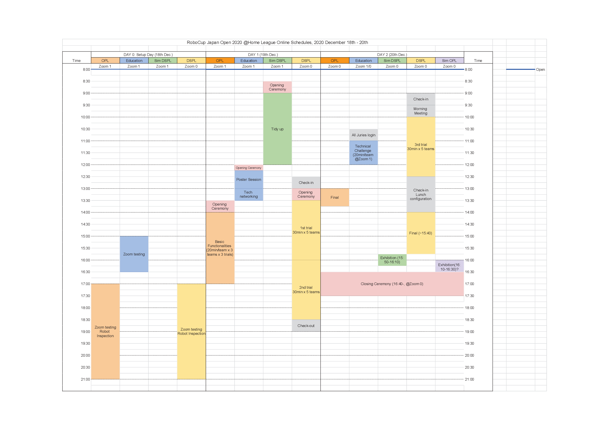

# ロボカップジャパンオープン2020 ＠ホームリーグ情報発信サイト
ロボカップジャパンオープン2020 ＠ホームリーグの情報発信用リポジトリです．

This is a repository for the information about RoboCup Japan Open 2020 @Home league.

[English](README_en.md) | 日本語

# 告知
<b>参加登録の締め切りを11月27日(金)まで延長いたします！</b>
ロボカップジャパンオープン2020 ＠ホームリーグのオンライン開催が決定しました！
- **日付：12/19(土) - 12/20(日)** ~~日付：12/12(土) - 12/13(日)~~
- 参加登録方法：[参加申し込みフォーム](https://forms.gle/TanniYUFrNaLV8Q46)にて受け付けております．参加費等詳細は[公式ホームページ](http://www.robocup.or.jp/japanopen2020b/news/entry-182.html)をご確認ください．
- 実施タスク，ルール：https://github.com/RoboCupAtHomeJP/Rule2020/blob/master/README.md にて公開しています．
- オンライン開催システム：調整中
- 現在の開催方針につきましては，[iHR研究会のWebサイトにアップロードされているPDF](https://drive.google.com/file/d/13UWuIczHnoTZCJEmtBwmEhNA-fjLnsEL/view)をご確認ください．
是非積極的なご参加，ご協力をお願いいたします．

# 暫定タイムテーブル
タイムテーブルは今後変更になることがあります。 
タイムテーブルに関するお問い合わせは[Issues](https://github.com/RoboCupAtHomeJP/AtHome2020/issues)までお願いいたします。

# 参加チーム
## Open Platform League (OPL)
| Team code | Team name | Affiliation |
| -- | -- | -- |
| AHOP-1   | SOBITS            | 創価大学    |
| AHOP-2   | Hibikino-Musashi@Home OPL  | 九州工業大学  |
| AHOP-3   | OIT-Challenger    | 大阪工業大学    |

## Domestic Standard Platform League (DSPL)
| チームコード 	| チーム名 | 所属 |
| -- 		| -- | -- |
| AHDSP-1	| Team Weblab	| 東京大学工学系研究科	|
| AHDSP-2	| eR@sers DSPL	| 玉川大学	|
| AHDSP-3	| Hibikino-Musashi@Home DSPL	| 九州工業大学	|
| AHDSP-4	| OIT-Real		| 大阪工業大学	|
<!-- | AHDSP-5	| 	| 	| -->

## Education League (Edu)
| チームコード | チーム名 | 所属 |
| -- | -- | -- |
| AHEDU-1	| Happy Robot	| 金沢工業大学	|
| AHEDU-2	| SOBITS		| 創価大学	|
| AHEDU-3	| eR@sers Education	| 玉川大学	|

## Simulation DSPL (S-DSPL)
| チームコード | チーム名 | 所属 |
| -- | -- | -- |
| AHSIM-1	| SOBITS	| 創価大学	|
| AHSIM-2	| OIT-R		| 大阪工業大学	|
| AHSIM-3	| Rits		| 立命館大学	|
| AHSIM-4	| eR@sers simulation	| 玉川大学	|
| AHSIM-5	| Hibikino-Musashi@Home Sim DSPL	| 九州工業大学	|
| AHSIM-6	| TA		| Private	|
| AHSIM-7	| PUTRABOT	| Universiti Putra Malaysia	|
| AHSIM-8	| 海城中高物理部	| 海城中学高等学校	|
<!-- | 	| 	| 	| -->

## リンク
- [ロボカップ日本委員会公式ページ](http://www.robocup.or.jp/japanopen2020b/)

