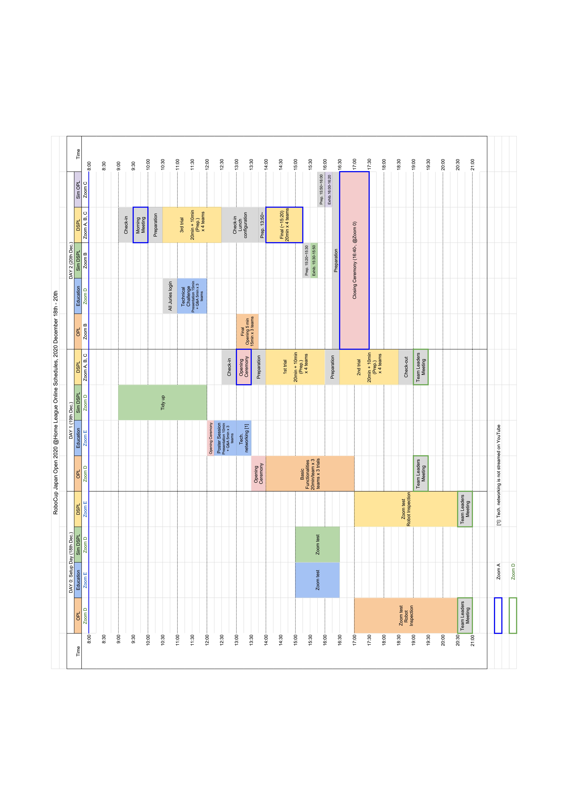

# ロボカップジャパンオープン2020 ＠ホームリーグ情報発信サイト
ロボカップジャパンオープン2020 ＠ホームリーグの情報発信用リポジトリです。大会終了まで頻繁に更新されます。 
ルール決定のための議論などはSlackのワークスペース、「RoboCup@HomeJP」で行っております。各チーム代表者の方は必ずご参加の上、内容を毎日確認していただきますようお願いいたします。

This is a repository for the information about RoboCup Japan Open 2020 @Home league.

[English](README_en.md) | 日本語

# お知らせ
ロボカップジャパンオープン2020 ＠ホームリーグのオンラインで開催されます。
- **日付：12/18(金) - 12/20(日)** ~~日付：12/12(土) - 12/13(日)~~
- 実施タスク，ルール：[ルール公開用リポジトリにて公開しています](https://github.com/RoboCupAtHomeJP/Rule2020/blob/master/README.md)
- オンライン開催システム：Zoom（競技参加者向け）, YouTube Live（一般向け）

<a href="http://www.robocup.or.jp/japanopen2020b/leagues/entry-199.html">ライブ配信のプログラムはこちらをご覧ください</a>。

## OPL, DSPL共通連絡
### スコアの公開について
(12月20日更新) 
各種タスクの点数を公開しました．

- [OPL 各種タスクスコア](score/opl_score.pdf)
- [DSPL 各種タスクスコア](score/dspl_score.pdf)
- [OPL, DSPL 最終スコア](score/opl_dspl_final_score.pdf)

### Finalの動画について【OPL, DSPL】
(12月11日更新) 
Final動画の提出方法を決定いたしました。提出期限は**12月19日 (Day1) 正午**です。 
[詳細はこちらをご確認ください](documents/finalVideo.md)。

### Unknown Ubjectsの発送について【OPL, DSPL】
(12月11日更新) 
Unknown Objects (UO)は「各リーグがUOを事前に用意して、他のチームに前もって発送する」という形式で準備します。届いたオブジェクトは**競技開始前に指示があるまで開封しない**でください。 
[発送手順の詳細はこちらのPDFファイルをご確認ください](documents/RCJ2020_UnknownObjects_手順書_GitHub.pdf)。 
オブジェクトの発送先リストと、DSPLのUOを記載するオブジェクトリストは、各チームの代表者にSlackのワークスペース「RoboCup@HomeJP」で共有しています。

オブジェクトは**18日までに各チームの元に届くように準備**していただきますよう、よろしくお願いいたします。

### Zoomの命名規則について
競技当日Zoomに参加される方は、以下の規則に従ってZoomの表示名を変更してください。
Zoomの接続情報はSlack、メールなどでお知らせいたします。

* PCで参加される方
    - `リーグ名`-`チーム名`-`PC`
* スマートフォンで参加される方
    - `リーグ名`-`チーム名`-`HP`

例）
OPL-HMA-PC

## OPL参加者向けの連絡
<a href="OPL.md">こちらのページをご覧ください</a>。

## DSPL参加者向けの連絡
<a href="DSPL.md">こちらのページをご覧ください</a>。

# タイムテーブル
（12月11日更新） 
DSPLの参加チーム数が確定しましたので、タイムテーブルを更新しました。 
Day2 Simulation Exhibitionの前後に入れ替えのための準備時間を設けました。 
（12月14日更新） 
Team Leaders Meetingの枠を追加しました。

タイムテーブルに関するお問い合わせは[Issues](https://github.com/RoboCupAtHomeJP/AtHome2020/issues)までお願いいたします。

* Day 0とDay 1のTeam Leaders Meeting (TLM)はOPLとDSPLが合同で行います 
タイムテーブルには開始時刻の目安を載せています。チーム代表者の皆様には開始前にSlackでご連絡いたします。

### Robot Inspection (RI)
順番の指定はありません。準備ができたチームから順にTCに申告してください。

# 参加チーム
## Open Platform League (OPL)
| Team code | Team name | Affiliation |
| -- | -- | -- |
| AHOP-1   | SOBITS            | 創価大学    |
| AHOP-2   | Hibikino-Musashi@Home OPL  | 九州工業大学  |
| AHOP-3   | OIT-Challenger    | 大阪工業大学    |

## Domestic Standard Platform League (DSPL)
| チームコード 	| チーム名 | 所属 |
| -- 		| -- | -- |
| AHDSP-1	| Team Weblab	| 東京大学工学系研究科	|
| AHDSP-2	| eR@sers DSPL	| 玉川大学	|
| AHDSP-3	| Hibikino-Musashi@Home DSPL	| 九州工業大学	|
| AHDSP-4	| OIT-Real		| 大阪工業大学	|
<!-- | AHDSP-5	| 	| 	| -->

## Education League (Edu)
| チームコード | チーム名 | 所属 |
| -- | -- | -- |
| AHEDU-1	| Happy Robot	| 金沢工業大学	|
| AHEDU-2	| SOBITS		| 創価大学	|
| AHEDU-3	| eR@sers Education	| 玉川大学	|

## Simulation DSPL (S-DSPL)
| チームコード | チーム名 | 所属 |
| -- | -- | -- |
| AHSIM-1	| SOBITS	| 創価大学	|
| AHSIM-2	| OIT-R		| 大阪工業大学	|
| AHSIM-3	| Rits		| 立命館大学	|
| AHSIM-4	| eR@sers simulation	| 玉川大学	|
| AHSIM-5	| Hibikino-Musashi@Home Sim DSPL	| 九州工業大学	|
| AHSIM-6	| *キャンセル*	| - |
| AHSIM-7	| PUTRABOT	| Universiti Putra Malaysia	|
| AHSIM-8	| 海城中高物理部	| 海城中学高等学校	|
| AHSIM-9	| Dongyang Sim	| Prince of Songkla University	|
| AHSIM-10	| b-it-bots	| Hochschule Bonn-Rhein-Sieg	|
<!-- | 	| 	| 	| -->

## リンク
- [ロボカップ日本委員会公式ページ](http://www.robocup.or.jp/japanopen2020b/)
- [ルール公開用リポジトリ](https://github.com/RoboCupAtHomeJP/Rule2020)

